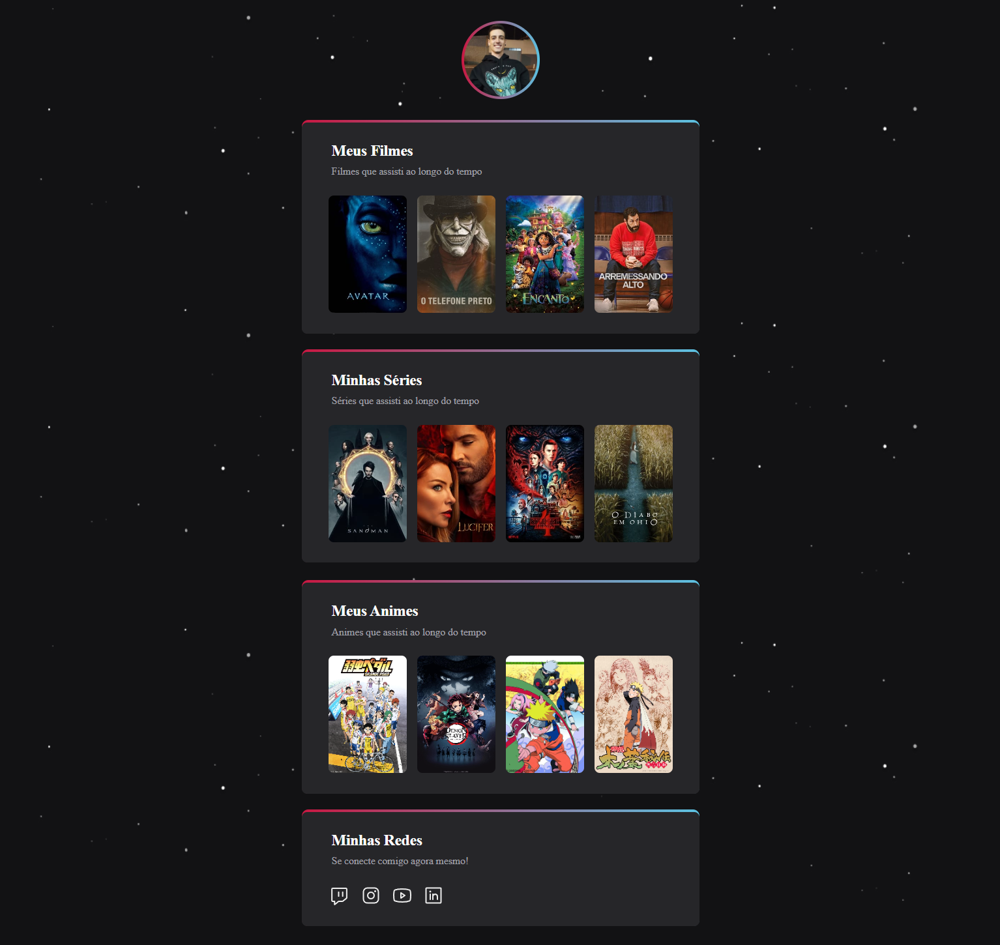

# Projeto What I Watch

 Projeto pessoal What I Watch (O que eu assisti) construído a partir de um desafio criado pela Rocketseat.
- [Clique aqui para acessar](https://desenvjonathan.github.io/what-i-watch/)

## Atualizações Futuras 
Esse é um projeto que será atualizado sempre que eu assistir um filme, série ou anime, para colocá-lo na lista de forma educativa, e sempre manter contato com as informações aprendidas.
- Barra de rolagem ou seta que faz a lista andar para a direita e esquerda
- Sistema de pesquisa, para poder navegar dentro do que foi assistido

## Tecnologias

- HTML
- CSS 
- Git e Github

## Contatos

#### E-mail: desenvjonathan@hotmail.com
#### LinkedIn: https://www.linkedin.com/in/jonathan-ramos-p/

## Referências

- site das imagens e links dos filmes: https://www.themoviedb.org/movie
- site das imagens e links dos animes: https://crunchy-dl.com/